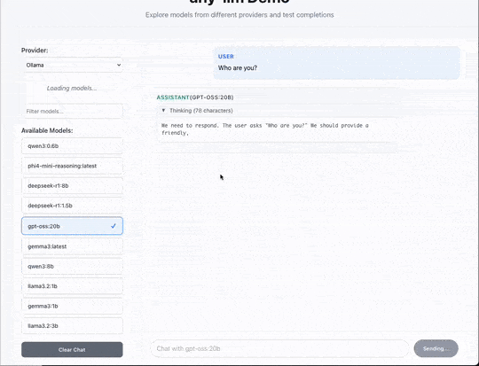

# any-llm Demo: List Models & Completions

This demo showcases the ability of any-llm to discover and use models across a variety of providers



## Features

- **Provider Discovery**: View all providers that support the `list_models` API
- **Model Listing**: Dynamically fetch available models from any supported provider
- **Streaming Chat**: Real-time streaming responses

## Setup

### Backend (FastAPI)

1. Navigate to the backend directory:
   ```bash
   cd backend
   ```

2. Install dependencies with uv:
   ```bash
   uv sync
   ```

3. Set up provider environment variables:
   ```bash
   # Set API keys for the providers you want to use
   export OPENAI_API_KEY="your-openai-api-key"
   export ANTHROPIC_API_KEY="your-anthropic-api-key"
   export GOOGLE_API_KEY="your-google-api-key"
   export MISTRAL_API_KEY="your-mistral-api-key"
   # ... add other provider API keys as needed
   ```

   All providers supported by any-llm will be displayed in the frontend, but the requests to that provider will fail
   unless you have the correct environment variables set. See https://mozilla-ai.github.io/any-llm/providers/ to understand what
   env vars are expected.


4. Run the server:
   ```bash
   uv run python main.py
   ```

The API will be available at `http://localhost:8000`

### Frontend (React)

1. Navigate to the frontend directory:
   ```bash
   cd frontend
   ```

2. Install dependencies:
   ```bash
   npm install
   ```

3. Start the development server:
   ```bash
   npm start
   ```

The frontend will be available at `http://localhost:3000`
